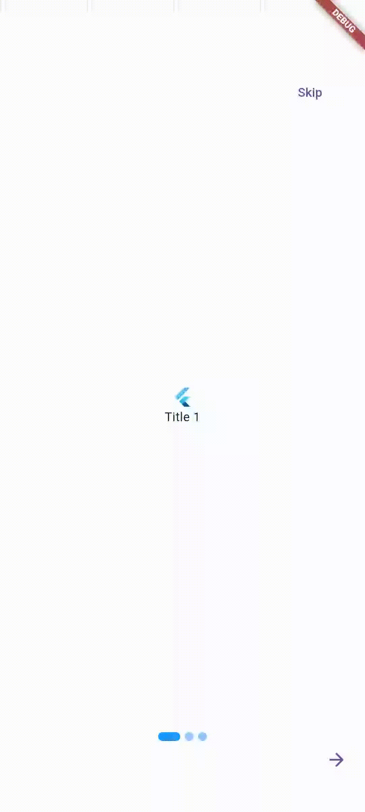

# Introduction Slider Extended



This library is a fork of the  _[Introduction_Slider](https://github.com/chouhan-rahul/introduction_slider/)_ library

An introduction slider has some screens that can use to describe your application. You can describe your application's title, description, logo, etc. It comes with several features.

Here is an example of how to implement IntroductionSlider in a Flutter application.

```dart
IntroductionSlider(
  items: [
    IntroductionSliderItem(
      logo: FlutterLogo(),
      title: Text("Title 1"),
      backgroundColor: Colors.white,
    ),
    IntroductionSliderItem(
      logo: FlutterLogo(),
      title: Text("Title 2"),
      backgroundColor: Colors.pink,
    ),
    IntroductionSliderItem(
      logo: FlutterLogo(),
      title: Text("Title 3"),
      backgroundColor: Colors.grey,
    ),
  ],
  done: Done(
    child: Icon(Icons.done),
  ),
  onDone: () {
    /// Your route for the next page or the action you want
    /// perform pressing the done button.
},
  next: Next(child: Icon(Icons.arrow_forward)),
  back: Back(child: Icon(Icons.arrow_back)),
  dotIndicator: DotIndicator(),
)
```

## IntroductionSlider Properties

| Property         | Type                                                    | Description                                                                                              |
|------------------|---------------------------------------------------------|----------------------------------------------------------------------------------------------------------|
| items:           | List<[IntroductionSliderItem](#introductionslideritem)> | Defines the appearance of the introduction slider items that are arrayed within the introduction slider. |
| done:            | [Done](#done)                                           | The [Done](#done) that is used to navigate to the target page.                                           |
| onDone:          | VoidCallback                                            | The [onDone](#onDone) action that is performed when the done button is pressed                           |
| back:            | [Back](#back)                                           | The [Back](#back) that is used to navigate to the previous page.                                         |
| next:            | [Next](#next)                                           | The [Next](#next) that is used to navigate to the next page.                                             |
| skip:            | [Skip](#skip)                                           | The [Skip](#skip) that is used to navigate to the previous page.                                         |
| initialPage:     | int                                                     | The initial page index of the introduction slider.                                                       |
| dotIndicator:    | [DotIndicator](#dotindicator)                           | The [DotIndicator](#dotindicator) that is used to indicate dots.                                         |
| physics:         | ScrollPhysics                                           | Determines the physics of a `[Scrollable]` widget.                                                       |
| scrollDirection: | Axis                                                    | The two cardinal directions in two dimensions.                                                           |
| showStatusBar:   | bool                                                    | Show and hide app status/navigation bar on the introduction slider.                                      |

# IntroductionSliderItem
It is used to describe the title, subtitle, logo, etc. of the introduction slider.

Here is an example of how to implement `IntroductionSliderItem` with background color.

```dart
IntroductionSliderItem(
  logo: FlutterLogo(),
  title: Text("Introduction Slider Title"),
  subtitle: Text("Introduction Slider Subtitle"),
  backgroundColor: Colors.red
)
```

Here is an example of how to implement `IntroductionSliderItem` with gradient background.


```dart
IntroductionSliderItem(
  logo: FlutterLogo(),
  title: Text("Introduction Slider Title"),
  subtitle: Text("Introduction Slider Subtitle"),
  gradient: LinearGradient(
    colors: [
      Colors.cyan,
      Colors.indigo,
    ],
  ),
)
```

Here is an example of how to implement `IntroductionSliderItem` with background image.

```dart
IntroductionSliderItem(
  logo: FlutterLogo(),
  title: Text("Introduction Slider Title"),
  subtitle: Text("Introduction Slider Subtitle"),
  backgroundImageDecoration: BackgroundImageDecoration(
    image: AssetImage("path/to/your/image.jpg"),
    colorFilter: ColorFilter.mode(
      Colors.black.withOpacity(0.6),
      BlendMode.darken,
    ),
    fit: BoxFit.cover,
    opacity: 1.0,
  ),
)
```

## IntroductionSliderItem Properties

| Property                   | Type                                                                  | Description                                     |
| -------------------------- | --------------------------------------------------------------------- | ----------------------------------------------- |
| logo:                      | Widget                                                                | Logo of the introduction slider.                |
| title:                     | Widget                                                                | Title of the introduction slider.               |
| subtitle:                  | Widget                                                                | Subtitle of the introduction slider.            |
| backgroundColor:           | Color                                                                 | Background color of the introduction slider.    |
| backgroundImageDecoration: | [BackgroundImageDecoration](#properties-of-backgroundimagedecoration) | Background image of the introduction slider.    |
| gradient:                  | Gradient                                                              | Gradient background of the introduction slider. |

## Properties of BackgroundImageDecoration

| Property     | Type          | Description                                                                |
| ------------ | ------------- | -------------------------------------------------------------------------- |
| image:       | ImageProvider | Typically this will be an AssetImage or a NetworkImage                     |
| fit:         | BoxFit        | Fill the target box by distorting the source's aspect ratio.               |
| colorFilter: | ColorFilter   | A color filter is a function that takes two colors, and outputs one color. |
| opacity:     | double        | Used to set the filterQuality of the image.                                |

# Scroll / Gesture control
A page can be scrolled horizontally or vertically. The default scroll direction is horizontal. You can change the scroll direction by setting the `scrollDirection` property.

```dart
IntroductionSlider(
  scrollDirection: Axis.vertical,
)
```
You can also control the introduction slider by gestures. You can set the `physics` property to `NeverScrollableScrollPhysics()` to disable the gesture slide.

```dart
IntroductionSlider(
  physics: NeverScrollableScrollPhysics(),
)
```

# onDone
When u press on the done button these are the action you will perform

```dart
IntroductionSlider(
  onDone: () {
    print('Press Done');
},
)
```

# DotIndicator
The dot indicator is used to indicate the current page. You can change the color of the dot indicator and the size of the dot indicator.

```dart
DotIndicator(
  selectedColor: Colors.blue,
  unselectedColor: Colors.blue.withOpacity(0.5),
  size: 8.0
)
```

## DotIndicator Properties

| Property         | Type   | Description                      |
| ---------------- | ------ | -------------------------------- |
| selectedColor:   | Color  | The selected color of the dot.   |
| unselectedColor: | Color  | The unselected color of the dot. |
| size:            | double | The size of the dot.             |

# Done

`Done` has some more properties which are used to redirect to the target page with an animation effect. `animationDuration` is used to set the duration of the animation and `curve` is used to set the animation curve.

```dart
Done(
  child: Icon(Icons.done),
)
```

## Done Properties

| Property           | Type        | Description                                                                                                                                 |
| ------------------ | ----------- | ------------------------------------------------------------------------------------------------------------------------------------------- |
| child:             | Widget      | Done button's child widget.                                                                                                                 |
| style:             | ButtonStyle | Many of the ButtonStyle properties are `[MaterialStateProperty]` objects which resolve to different values depending on the button's state. |


# Next

`Next` has some more properties which are used to redirect to the next slide page with an animation effect. `animationDuration` is used to set the duration of the animation and `curve` is used to set the animation curve.

```dart
Next(
  child: Icon(Icons.done),
  curve: Curves.easeInOut,
  animationDuration: Duration(milliseconds: 350),
)
```

## Next Properties

| Property           | Type        | Description                                                                                                                                 |
| ------------------ | ----------- | ------------------------------------------------------------------------------------------------------------------------------------------- |
| child:             | Widget      | Next button's child widget.                                                                                                                 |
| style:             | ButtonStyle | Many of the ButtonStyle properties are `[MaterialStateProperty]` objects which resolve to different values depending on the button's state. |
| curve:             | Curve       | A collection of common animation easing curves.                                                                                             |
| animationDuration: | Duration    | The animation lasts for the given duration and follows the given curve. The returned `[Future]` resolves when the animation completes.      |

# Back

`Back` has some more properties which are used to redirect to the previous slide page with an animation effect. `animationDuration` is used to set the duration of the animation and `curve` is used to set the animation curve.

```dart
Back(
  child: Icon(Icons.done),
  curve: Curves.easeInOut,
  animationDuration: Duration(milliseconds: 350),
)
```

## Back Properties

| Property           | Type        | Description                                                                                                                                 |
| ------------------ | ----------- | ------------------------------------------------------------------------------------------------------------------------------------------- |
| child:             | Widget      | Next button's child widget.                                                                                                                 |
| style:             | ButtonStyle | Many of the ButtonStyle properties are `[MaterialStateProperty]` objects which resolve to different values depending on the button's state. |
| curve:             | Curve       | A collection of common animation easing curves.                                                                                             |
| animationDuration: | Duration    | The animation lasts for the given duration and follows the given curve. The returned `[Future]` resolves when the animation completes.      |

# Skip

`Skip` has some more properties which are used to redirect to the last slide page with an animation effect. `animationDuration` is used to set the duration of the animation and `curve` is used to set the animation curve.

```dart
Skip(
  child: Icon(Icons.done),
  curve: Curves.easeInOut,
  animationDuration: Duration(seconds: 1),
)
```

## Skip Properties

| Property           | Type        | Description                                                                                                                                 |
| ------------------ | ----------- | ------------------------------------------------------------------------------------------------------------------------------------------- |
| child:             | Widget      | Skip button's child widget.                                                                                                                 |
| style:             | ButtonStyle | Many of the ButtonStyle properties are `[MaterialStateProperty]` objects which resolve to different values depending on the button's state. |
| curve:             | Curve       | A collection of common animation easing curves.                                                                                             |
| animationDuration: | Duration    | The animation lasts for the given duration and follows the given curve. The returned `[Future]` resolves when the animation completes.      |

# Hide/Show status bar and navigation bar

By default `showStatusBar` is false. You can show status bar and navigation bar by setting `showStatusBar` to true.

```dart
IntroductionSlider(
  showStatusBar: true,
)
```

# Report bugs or issues

You are welcome to open a _[ticket](https://github.com/codexnabbo/introduction_slider/issues)_ on github if any problems arise. New ideas are always welcome.

# Copyright and License

> Copyright © 2024 Riccardo Pasquetto. Licensed under the _[MIT LICENSE](https://github.com/codexnabbo/introduction_slider/blob/main/LICENSE)_.

### Become a sponsor

[](https://github.com/codexnabbo)
_[](https://www.buymeacoffee.com/riccardopasquetto)_
